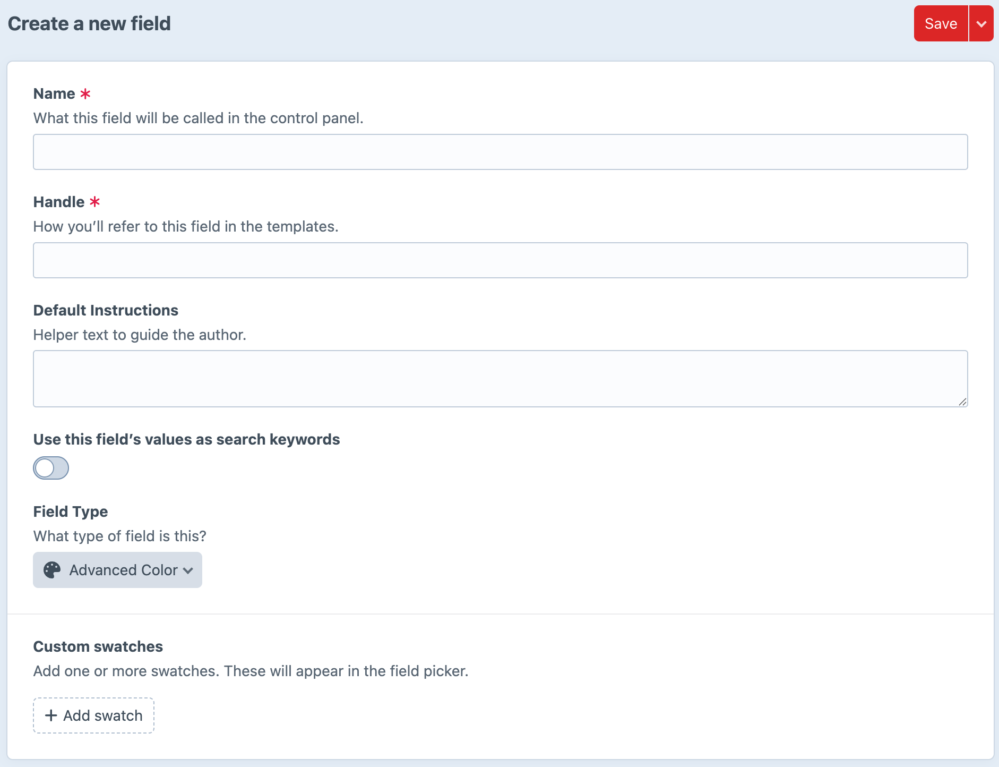
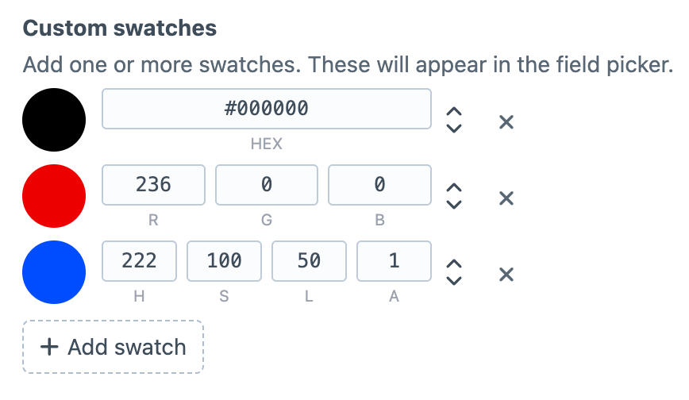
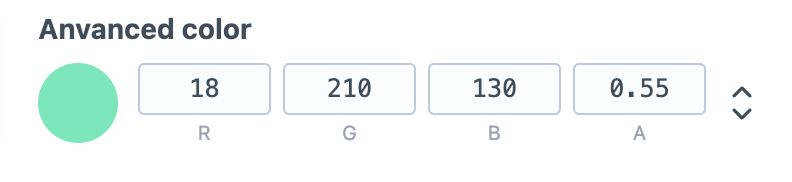
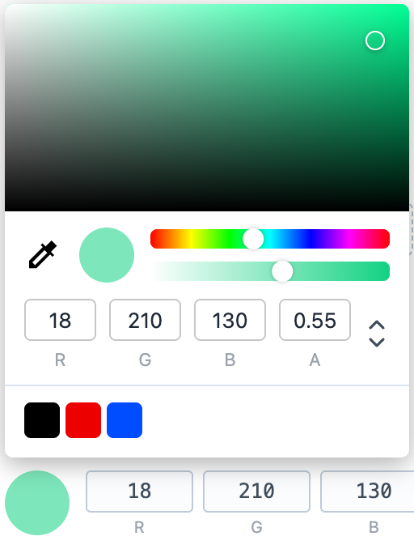

# Advanced color field

A standalone Craft CMS field type that stores color + alpha and provides a modern color picker UI.

## Features

- Field type: **Color (Alpha)**
- Supports HEX, RGB, RGBA, HSL, HSLA editing
- Stores normalized value with alpha support
- Optional custom swatches in field settings
- Twig-friendly output helpers

## Screenshots

### 1. Adding the field


### 2. Adding custom swatches


### 3. Field in CP frontend


### 4. Color picker modal


## Requirements

- PHP `^8.2`
- Craft CMS `^5.0`

## Installation

Install via Composer:

```bash
composer require kdgraphics/advanced-color-field:^1.0
```

Then install the plugin in Craft:

```bash
php craft plugin/install advanced-color-field
```

## Field usage in Twig

Assuming your field handle is `brandColor`:

```twig


  {{ c.hex }}
  {{ c.hex8 }}
  {{ c.rgb }}
  {{ c.rgba }}
  {{ c.hsl }}
  {{ c.hsla }}
  {{ c.alpha }}
  {{ c.opacity }}

```

## License

Craft
